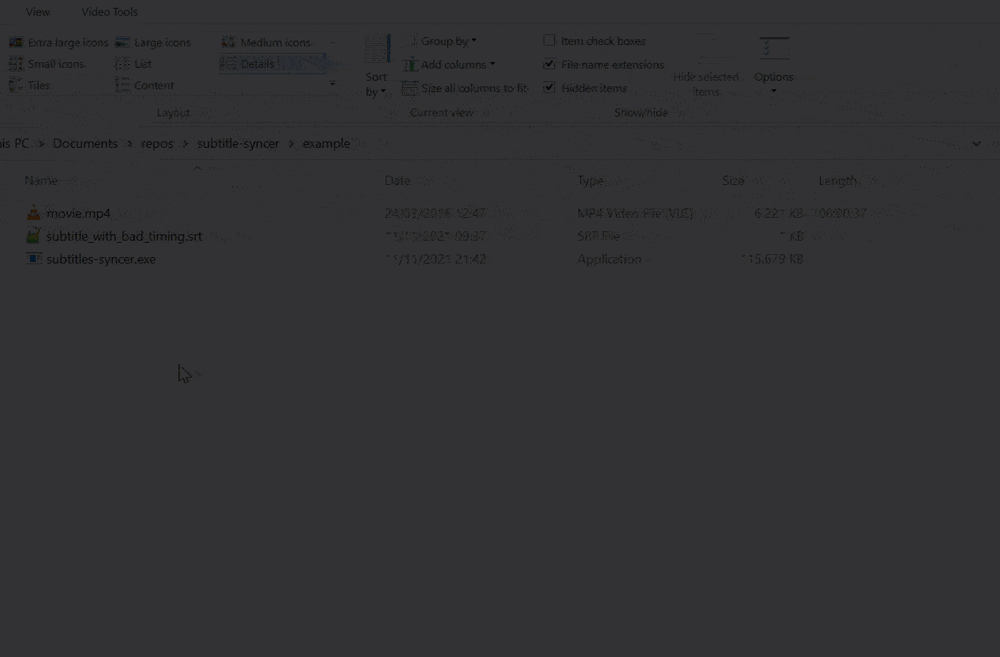

# Subtitle Syncer

This program fixes a subtitle file timings by syncing them to the audio of a movie using offline speech recognition.

[Download program](https://archive.org/download/subtitles-syncer/subtitles-syncer.exe)

## Demo:

## Possible improvements:

* Currently, only supports windows, but this can be extended by adding vosk and ffmpeg binaries for linux and mac-os and fixing the file paths.
* Improve heuristic for matching the existing subtitle text to the generated subtitle timings. Have more focus on keeping the subtitles in the same order.

## Development

* clone the repository
* make sure you have NodeJS installed (v16.x.x)
* run `npm install`
* download [the vosk model](https://alphacephei.com/vosk/models) and store it under `./vosk-speech-model` (so that `vosk-speech-model/am/final.mdl` exists)
* run `npm run start:example1`

## Building

* run `npm run build`
* the exe will be created in the `dist/` folder
